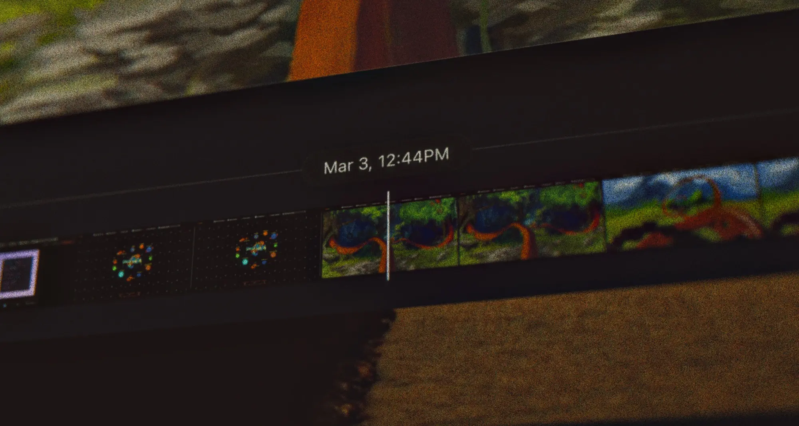

# Saw it once, find it forever.

Orbit records your Mac's screen activity in the background, letting you instantly search and revisit anything you've seen. Everything stays local on your device. Orbit requires macOS 14.0 (Sonoma) or later.

Visit [reachorbit.app](https://reachorbit.app) to sign up for the preview release and get early access.
